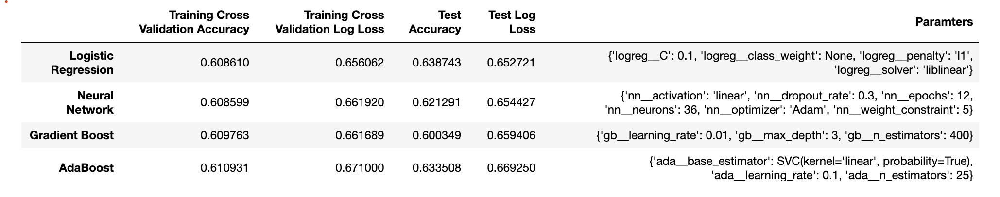
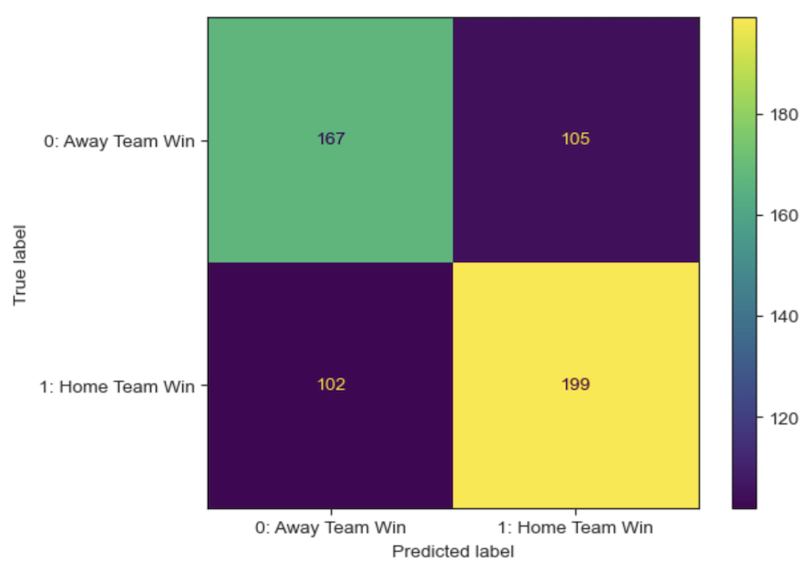

# Modeling NHL Win Probabilities

Building binary classification models to predict the winning team in an NHL matchup.

## Overview

The primary purpose of this model is to see if the winner of an NHL game can be predicted with more accuracy than with a naive prediction - choosing the home team to win every time with no other informative input.

In this project several modeling techniques will be trained/tested using team game log data from the prior three full NHL regular seasons (19'-20', 20'-21', 21'-22). Games played to date from the current season (22'-23') will then be used to evaluate the model's ability to correctly predict the winning team.

## Business and Data Understanding

### Stakeholders & Business Problem

- With sports betting becoming increasingly popular and mainstream, data science can be used to make superior decisions over gut intuitions.
- Moneyline betting (betting who will win with no caveats) is the most common type of sports bet
- Can bettors gain an edge?
  - This project aims to answer that question by testing the ability to better predict outcomes than naive choices
  - Naive choice for this test is predicting whether the home team will win
- Goal: Build a model that outputs more accurate probabilities to validate hypothesis and greenlight more in depth testing
- Applicable stakeholders:
  - Bettors can use this model to improve their odds of success
  - Sportsbooks can benefit by using to ensure their odds lines are optimally set
  - There are a myriad of subscription bet recommendation sites constantly searching for an edge in an increasingly competitive space

### Data Understanding

Source and Methodology

- 2019-2020 season through the current season (2022-2023)
- Team performance stats at the game level from [Natural Stat Trick](https://www.naturalstattrick.com/games.php)
- Official game results scraped from the NHL API
- Target variable is whether or not the home team one
- Features include a mix of advanced offensive, defensive and goaltending stats
  - Stats are in game share rate form
    - Highlights team performance relative to opponents for both the home and away sides 
  - Stats are transformed by taking the prior ten game rolling average and shifted back one game
    - The shifting is necessary to predict future results, as we will not know game stats until after a game begins/ends
  - 10 games was chosen for the window given the streakiness of NHL play and how much can change over bigger horizons due to injuries, trades, etc
  - Detailed definitions of the different stats used can be found in the data processing notebook

## Modeling

### Methodology and Evaluation

- Optimize for log loss and accuracy
- Train on the 19-20 season through the first half of this season
- Evaluate and predict on the second half of this season
- Use rolling means of features with a window of 10 games
- Classification modeling
  - Logistic Regression
  - Gradient Boosting Classifier
  - AdaBoost Classifier
  - Neural Network
- GridsearchCV to identify best model parameters

### Models

Naive Choice

- Establishing a baseline by choosing the home team to win every time
- Home advantage has always been considered important in sports
  - Picking the home team every time would result in being correct 52.67% of the time
  

Basic logistic regression

- I deployed an out of the box logistic regression model to serve as our modeling baseline
- Scoring:
  - Test accuracy: 0.58
  - Test log loss score: 0.665
  

Gridsearch results for the 4 types of models tested
  

Cross Validated Logistic Regression

- Best performing model
- Scoring on holdout dataset:
  - Test accuracy: 0.64
  - Test log loss score: 0.653
  

## Conclusions & Next Steps

### Conclusions

- Modeling publicly available data can beat naive choices
- The percentage of times my prediction correctly had the home team winning was 63.87%
  - Given that my log loss is in line with the industry benchmark and the model's accuracy outperformed the naive choice by more than 11%, I am encouraged by these results and plan to further improve this research/modeling
- Future work will not only focus on iteratively improving the models predictive capability
- To translate this model into real world value, the next phase of work will focus on developing a profitable betting model based on this existing game prediction model

### Next Steps

- Now that the ability to beat the home team naive prediction, I am interested in testing framing this problem from the perspective of the favored team as the plan is to turn this project into a betting model
- Next I will test layering in info from sportsbooks, to evaluate if framing this from the favorite be  beneficial or cause problems such as overfitting
  - The relatively efficient betting market could provide valuable predictive power
  - Or would it be noisy or cause overfitting?
- Once that test is completed work on improving the current model, modeling a profitable betting strategy, and building an app to display upcoming schedule, odds and recommendations can commence
- With regards to this model, potential improvements will focus on revisiting feature selection/engineering
  - Testing different team stats and/or try to incorporate individual stats
  - Trying different rolling windows and see how predictions fare at different points in the season

## Repo Structure

```
├── data
├── imgs
├── .gitignore
├── Predicting NHL Game Winners.pdf
├── README.md
├── nhl-predictions-data-processing.ipynb
└── nhl-predictions-modeling.ipynb
```
